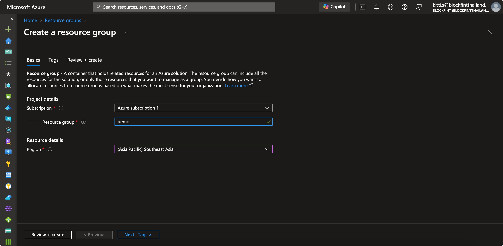
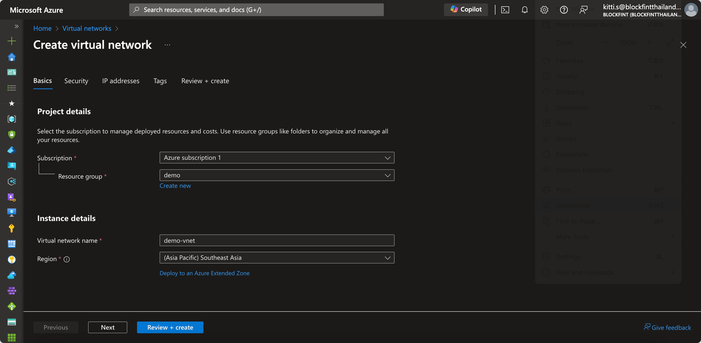
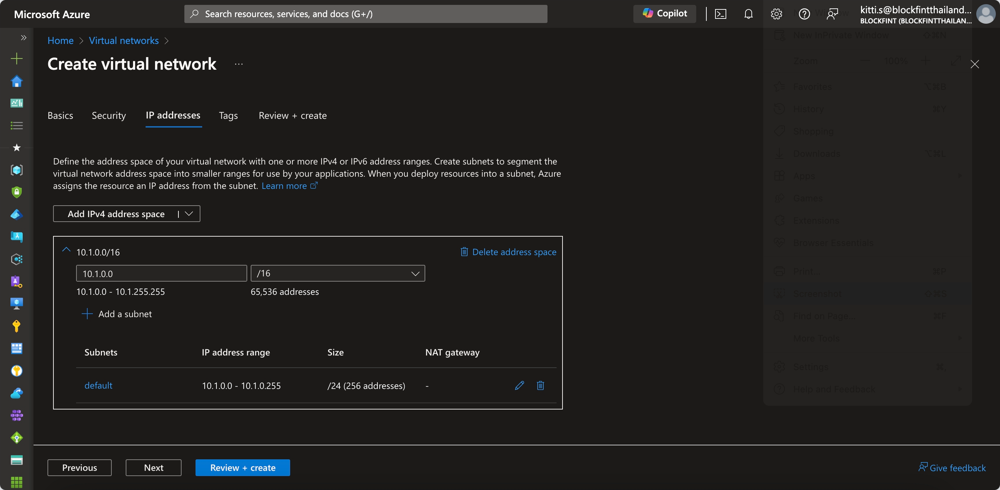

# Lab: Benefits of IaC

## Benefits of IaC

While there are many benefits of Infrastructure as Code, a few key benefits include the simplification of cloud adoption, allowing us to quickly adopt cloud-based services and offerings to improve our capabilities. Infrastructure as Code allows us to remove many of the manual steps required today for infrastructure requests, giving us the ability to automate approved requests without worrying about tickets sitting in a queue. We can also use Infrastructure as Code to provide capacity on-demand by offering a library of services for our developers, even publishing a self-service capability where developers and application owners can be empowered to request and provision infrastructure that better matches their requirements. Again, all of this is possible while driving standardization and consistency throughout the organization, which can drive efficiencies and reduce errors or deviations from established norms.

References

[Infrastructure as Code in a Private or Public Cloud](https://www.hashicorp.com/blog/infrastructure-as-code-in-a-private-or-public-cloud)

# Lab Instructions

You have been tasked with deploying some basic infrastructure on Azure to host a proof of concept environment. The architecture needs to include both public and private subnets and span multiple Availability Zones to test failover and disaster recovery scenarios. You expect to host Internet-facing applications. Additionally, you have other applications that need to access the Internet to retrieve security and operating system updates.


- **Task 1:** Create a new resource group in the Southeast Asia region
- **Task 2:** Create a new Vnet with default Subnet in your resource group
- **Task 3:** Delete the vnet resource
- **Task 4:** Prepare files and credentials for using Terraform to deploy cloud resources 
- **Task 5:** Set credentials for Terraform deployment
- **Task 6:** Deploy the Azure infrastructure using Terraform
- **Task 7:** Delete the Azure resources using Terraform to clean up our Azure environment

The end state of the Azure environment should look similar to the following diagram:


> _This lab will walk you through configuring the infrastructure step by step using a manual process. After manually completing the tasks, the lab will show you how Terraform can be used to automate the creation of the same infrastructure._

## Task 1: Log into the Azure Console and Create a new resource group in the Southeast Asia region.


## Task 2: Create a new Vnet with default Subnet in your resource group



---

### **Congratulations, you have manually configured all of the resources and have an environment that now matches the desired configuration as stated by the requirements.**

---

Wasn't that fun? While this example given in the lab isn't too bad, how would you feel repeating this process across 10s or 100s of AWS accounts in your organization? It would be extremely time-consuming and a very monotonous task. Additionally, how confident would you be to repeat these tasks over and over without making a mistake that could impact production or the security of your infrastructure? That's where Infrastructure as Code (IaC) comes into the picture.

IaC allows us to easily replicate deployment tasks and take the human aspect out of repetitive tasks. By codifying your infrastructure, you can reduce or eliminate risks to the infrastructure running your applications. IaC makes changes idempotent, consistent, repeatable, and predictable. Plus, you can easily see how any modifications to your environment will impact your infrastructure before ever applying it.

Well, as much fun as that was, it's time to delete all of the resources that we just created. Note that normally you would need to delete the resources in a certain order since many of the resources are dependant on others. However, the VPC is unique in that you can delete the VPC and it will delete all associated resources if there aren't any other dependencies.

As you are deleting resources, note that manually deleting resources is sometimes risky, especially on a public cloud where forgotten resources could rack up a large bill. Additionally, leaving behind technical debt can impact future deployments and cause confusion when deploying future workloads.

## Task 3: Delete the VPC resources.

### **Step 3.1**

Prior to deleting the VPC, you must first delete the NAT gateway. Select NAT Gateways on the left navigation pane and delete the **_demo-nat-gateway_**. Afterwards, in the VPC Console, select the VPC that we just created by checking the tick box next to the VPC. From the Actions menu, select **_Delete VPC_**. Confirm you wish to delete the VPC and related AWS resources by typing _delete_ in the text box at the bottom of the prompt. Click the **_Delete_** button.


## Task 4: Prepare files and credentials for using Terraform to deploy cloud resources.

### **Step 4.1**

On your workstation, navigate to the `/workstation/terraform` directory. This is where we'll do all of our work for this training. Create a new file called `main.tf` and `variables.tf`.

In the `variables.tf`, copy the following variable definitions and save the file. Don't worry about understanding everything just yet, we'll learn all about variables in Objective 3.

```hcl
variable "azure_region" {
  type    = string
  default = "Southeast Asia"
}

variable "vpc_name" {
  type    = string
  default = "demo_vpc"
}

variable "vnet_cidr" {
  type    = string
  default = "10.1.0.0/16"
}

variable "snet_cidr" {
  type    = string
  default = "10.1.1.0/24"
}
```

In the `main.tf` file, copy the following Terraform configuration and save the file.

```hcl
provider "azurerm" {
  features {}
}

resource "azurerm_resource_group" "demo" {
  name     = "demo"
  location = var.azure_region
}

resource "azurerm_virtual_network" "demo_vnet" {
  name                = "demo-vnet"
  address_space       = [var.vnet_cidr]
  location            = azurerm_resource_group.demo.location
  resource_group_name = azurerm_resource_group.demo.name
}

resource "azurerm_subnet" "default" {
  name                 = "default"
  resource_group_name  = azurerm_resource_group.demo.name
  virtual_network_name = azurerm_virtual_network.demo_vnet.name
  address_prefixes     = [var.snet_cidr]
}
```

## Task 5: Set credentials for Terraform deployment

### **Step 5.1**
https://registry.terraform.io/providers/hashicorp/azurerm/latest/docs/guides/azure_cli


## Task 6: Deploy the AWS infrastructure using Terraform

### **Step 6.1**

The first step to using Terraform is initializing the working directory. In your shell session, type the following command:

```shell
terraform init
```

As a response, you should see something like the following output (note that the provider version might change):

```shell
terraform init
...
```

### **Step 6.2**

Now that our working directory is initialized, we can create a plan for execution. This will provide a preview of the changes to our AWS environment. To create a plan, execute the following command:

```shell
terraform plan
```

You should see an output similar to the one below. Note that the example below has been truncated for the sake of brevity:

```shell
Refreshing Terraform state in-memory prior to plan...
The refreshed state will be used to calculate this plan, but will not be
persisted to local or remote state storage.

data.aws_region.current: Refreshing state...
data.aws_availability_zones.available: Refreshing state...

------------------------------------------------------------------------

An execution plan has been generated and is shown below.
Resource actions are indicated with the following symbols:
  + create
...
```

Notice that Terraform will create 18 resources for us in our AWS environment, which includes all of the networking components we manually created in earlier steps.

### **Step 6.3**

For our final step to create our AWS resources, we need to apply the configuration. An apply will instruct Terraform to create the resources in AWS that are defined in our configuration file(s). And as we saw in our plan, it will create 18 resources for us. To execute the Terraform, run the following command:

```shell
terraform apply -auto-approve
```

> Note that we are using the -auto-approve flag for simplicity. You can leave it out, validate the changes to the environment, and type `yes` to validate you want to apply the configuration.

After running the above command, you should see output similar to the following:

```shell
data.aws_region.current: Refreshing state...
data.aws_availability_zones.available: Refreshing state...

An execution plan has been generated and is shown below.
Resource actions are indicated with the following symbols:
  + create
...
```

At this point, Terraform has created new resources in our AWS account that match the requirements stated at the beginning of the lab. Feel free to log into the AWS console and browse around. You should see the new VPC, subnets, route tables, NAT Gateway, and Internet Gateway. These should look just like our configuration, but completely automated by Terraform.

## Task 7: Delete the AWS resources using Terraform to clean up our AWS environment

### **Step 7.1**

The final step is to destroy all of the resources created by Terraform. By using Terraform to destroy the resources, you will ensure that every single resource deployed with Terraform is destroyed from your account. This ensures you don't leave anything behind that could incur costs or leave behind technical debt.

To destroy your resources, execute the following command in the terminal. You should see Terraform refresh the state of each resource and subsequently destroy it in the proper order.

```shell
terraform destroy -auto-approve
```

You should an output similar to the following:

```shell
aws_nat_gateway.nat_gateway: Destroying... [id=nat-037dd8aec387c4069]
..
```

### **Congratulations, you've reached the end of this lab.**